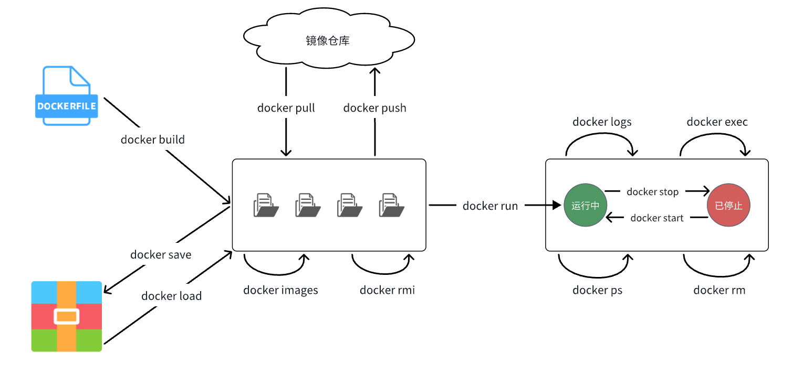

# Docker

---

## 什么是 Docker

Docker是一组平台即服务（PaaS）的产品。它基于操作系统层级的虚拟化技术，将软件与其依赖项打包为容器。托管容器的软件称为Docker引擎。Docker能够帮助开发者在轻量级容器中自动部署应用程序，并使得不同容器中的应用程序彼此隔离，高效工作。

## 常用的 Docker 命令

* docker -v：查看 docker 版本
* docker pull：拉取镜像
* docker images：查看本地镜像
* docker rmi：删除镜像，可根据镜像名/镜像id删除
* docker run：创建并运行容器
* docker ps：查看正在运行的容器
* docker ps -a：查看所有容器
* docker stop：停止容器
* docker start：启动容器
* docker restart：重启容器
* docker rm：删除容器，可根据容器名/容器id删除
* docker logs：查看容器运行日志
* docker exec：进入容器

