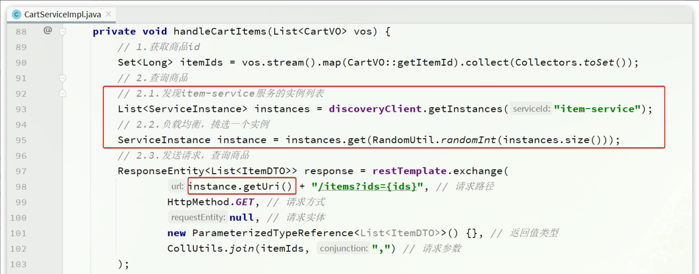
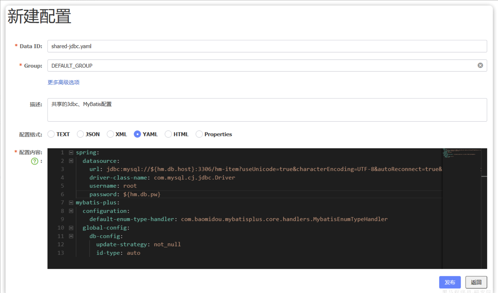
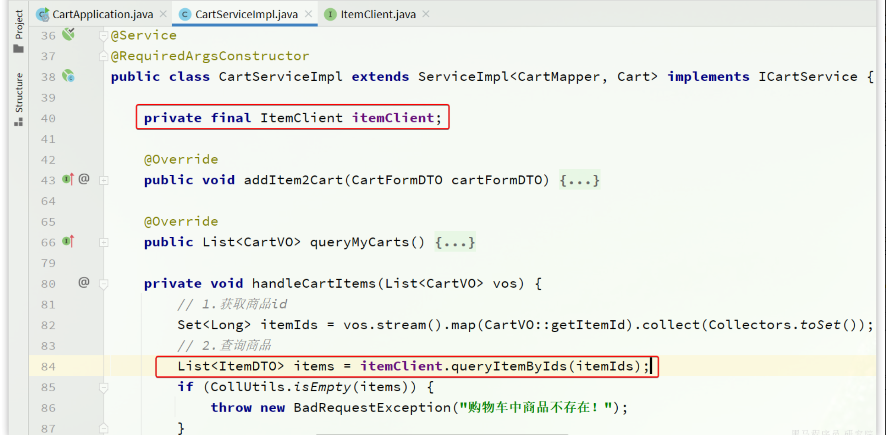
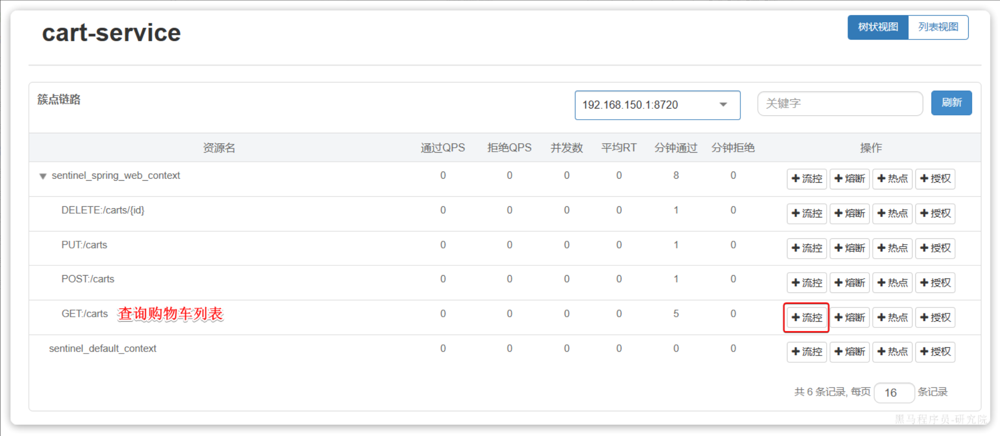

# Spring Cloud 微服务

---

## 1. 单体架构与微服务架构

为什么会有微服务架构？

首先，对于中小型的项目，单体架构是完全够用的。但是，对于大型项目，单体架构往往会面临以下问题：

* 维护起来难度大
* 打包部署时间长
* 功能模块之间共享服务器资源，并发量受到限制

所以，有了微服务架构。微服务架构将各功能模块拆分成一个个独立的服务，各服务之间保持单一职责，独立开发维护，独立部署上线，解决了单体架构在大型项目中面临的难题。

## 2. 微服务架构的解决方案

微服务架构通常是根据业务功能进行拆分，同时遵循高内聚、低耦合的软件设计原则。

实现微服务架构的主流技术是 Spring Cloud，Spring Cloud 是一套基于 Spring Boot 的微服务开发工具集，旨在帮助开发者快速构建微服务架构中的常见组件，如服务注册与发现、配置中心、负载均衡、熔断器、网关、链路追踪等。它提供了一套标准化、可插拔的解决方案，简化了微服务架构的开发和运维。

## 3. Nacos 注册中心

### 3.1 Nacos 是什么

Nacos 是 Alibaba 开源的注册中心，而且它不光是一个注册中心，还是一个配置中心。

注册中心是用来统一管理微服务，实现服务注册与服务发现的。在微服务架构中，每个服务一般都是多实例部署的，而且它们之间往往有相互调用的关系。如何统一管理这些服务，以及一个服务在调用另一个服务时如何获取另一个服务的相关信息成了一个问题，即服务注册与服务发现的问题。而注册中心就是用来解决这个问题的。所有服务在启动时可以向注册中心注册自己的相关信息，注册中心可以实时地监测各个服务的健康状态，并且当一个服务想调用另一个服务时，也可以从注册中心中获取相应服务的相关信息。

### 3.2 服务注册

1）要想将一个服务注册到 Nacos 注册中心中，首先要引入 Nacos 的相关依赖：

```xml
<dependency>
    <groupId>com.alibaba.cloud</groupId>
    <artifactId>spring-cloud-starter-alibaba-nacos-discovery</artifactId>
</dependency>
```

2）然后在 application.yml 配置文件中配置 Nacos 的地址：

```yaml
spring:
  application:
    name: 服务名称
  cloud:
    nacos:
      server-addr: Nacos的IP地址和端口
```

这样，服务在启动后就会自动注册到 Nacos 中，并且我们可以在 Nacos 的控制台中查看到服务的相关信息。

### 3.3 服务发现

1）要想实现服务发现，也需要引入 Nacos 的相关依赖并配置 Nacos的地址（和服务注册一样）。

2）然后可以通过 Spring Boot 帮我们自动装配的 `DiscoveryClient` 来获取到相应服务的信息。比如通过 `DiscoveryClient` 的 `getInstaces()` 方法可以获取当相应服务的所有实例，然后我们可以通过负载均衡算法挑选一个实例去发起远程调用：



### 3.4 配置管理

Nacos 不仅仅具备注册中心的功能，也具备配置管理的功能。

我们可以把微服务共享的配置抽取到 Nacos 中统一管理，这样就不需要每个微服务都重复配置了。而且，在 Nacos 控制台修改配置后，Nacos 会将配置变更推送给相关的微服务，并且无需重启即可生效，实现配置热更新。具体的步骤为：

1）在 Nacos 控制台的配置管理列表中新建一个配置：



2）引入 Nacos 配置管理相关依赖：

```xml
<!-- nacos配置管理 -->
<dependency>
    <groupId>com.alibaba.cloud</groupId>
    <artifactId>spring-cloud-starter-alibaba-nacos-config</artifactId>
</dependency>
<!-- 读取bootstrap文件 -->
<dependency>
    <groupId>org.springframework.cloud</groupId>
    <artifactId>spring-cloud-starter-bootstrap</artifactId>
</dependency>
```

3）新建一个 bootstrap.yml 文件，将 Nacos 相关配置写在这份配置文件中：

```yaml
spring:
  application:
    name: 服务名称
  cloud:
    nacos:
      server-addr: Nacos的IP地址和端口
      config:
        file-extension: yaml
        shared-configs: 
          - dataId: shared-jdbc.yaml
          - dataId: shared-log.yaml
          - dataId: shared-swagger.yaml
```

因为 bootstrap.yml 文件是最先被加载的，只有这样，才能在正确的时机拉取 Nacos 配置，并与本地的 application.yml 配置合并，完成项目上下文的初始化。

## 4. OpenFeign 远程调用

### 4.1 OpenFeign 是什么

OpenFeign 是 Alibaba 开源的远程调用框架，通过它可以大大简化远程调用的代码。

微服务架构中，一个服务调用另一个服务的过程称为远程调用。远程调用往往是微服务拆分后面临的第一个问题，我们当然可以通过手动构建 Http 请求的方式实现远程调用，但这太麻烦了。我们可以通过远程调用框架来简化代码，使远程调用就像调用本地方法一样简单而丝滑，而 OpenFeign 就是干这个的。

### 4.2 OpenFeign 的使用

1）使用 OpenFeign，首先需要引入 OpenFeign 相关依赖：

```xml
<dependency>
    <groupId>org.springframework.cloud</groupId>
    <artifactId>spring-cloud-starter-openfeign</artifactId>
</dependency>
```

2）通常我们还会引入一个负载均衡的依赖，用来在远程调用时实现负载均衡：

```xml
<dependency>
    <groupId>org.springframework.cloud</groupId>
    <artifactId>spring-cloud-starter-loadbalancer</artifactId>
</dependency>
```

3）此外，OpenFeign 底层依然是通过发送 Http 请求来实现远程调用的，并且可以灵活地切换不同的 Http 客户端。由于它默认使用的是  `HttpURLConnection`，不支持连接池，因此我们通常会使用带有连接池的 Http 客户端来代替默认的 `HttpURLConnection`。所以还可以引入一个带有连接池的 Http 客户端依赖：

```xml
<dependency>
  <groupId>io.github.openfeign</groupId>
  <artifactId>feign-okhttp</artifactId>
</dependency>
```

4）接下来，我们需要在 Spring Boot 的启动类或者配置类上添加 `EnableFeignClients` 注解用来开启 OpenFeign 远程调用功能。并且在 application.yml 配置文件中开启我们自己引入的 Http 客户端：

```yml
feign:
  okhttp:
    enabled: true
```

5）然后，我们可以针对要调用的服务编写一个 OpenFeign 客户端，其实就是一个接口，它大概是下面这样的形式：

```java
@FeignClient("item-service")
public interface ItemClient {
    @GetMapping("/items")
    List<ItemDTO> queryItemByIds(@RequestParam("ids") Collection<Long> ids);
}
```

这其实就是告诉 OpenFeign 我们想要调用的服务是什么，对应的接口和请求参数是什么。在使用时，OpenFeign 可以通过动态代理帮我们实现远程调用的相关逻辑，不用我们自己手动发起 Http 请求了。

6）最后，我们只需要在当前服务的业务代码中注入刚才编写的 OpenFeign 客户端，然后调用其中定义的接口方法，就可以一行代码实现远程调用了。在这个过程中，OpenFeign 自动帮我们实现了服务发现、负载均衡、发送 Http 请求等工作。



## 5. Gateway 网关路由

### 5.1 Gateway 是什么

Spring Cloud Gateway 是 Spring Cloud 生态系统中的一个网关组件，用于构建基于微服务架构的统一入口。它提供了一种现代化、高性能的方式来路由请求、处理跨切面关注点（如认证、限流、日志等），并支持响应式编程模型。

所谓网关就是网络的关口，所有的网络请求都会率先经过网关。在微服务架构中，由于业务被拆分成了一个个的微服务，由前端直接调用微服务比较困难，所以可以通过网关做路由转发。此时，前端不直接请求具体的微服务，而是请求网关，再由网关将请求转发到具体的微服务。

### 5.2 路由转发

Gateway 最核心的功能就是进行路由转发，具体步骤为：

1）创建网关微服务，并引入 Gateway 相关依赖。

网关本身也是一个独立的微服务来供前端调用，所以我们首先应该创建一个网关微服务。

然后引入相关的依赖，除了 Gateway 组件本身，我们还应该引入 Nacos 和负载均衡组件，以告诉 Gateway 其他微服务的相关信息和实现在多个微服务实例之间进行负载均衡：

```xml
<!-- Spring Cloud Gateway -->
<dependency>
    <groupId>org.springframework.cloud</groupId>
    <artifactId>spring-cloud-starter-gateway</artifactId>
</dependency>
<!-- Nacos -->
<dependency>
    <groupId>com.alibaba.cloud</groupId>
    <artifactId>spring-cloud-starter-alibaba-nacos-discovery</artifactId>
</dependency>
<!-- 负载均衡 -->
<dependency>
    <groupId>org.springframework.cloud</groupId>
    <artifactId>spring-cloud-starter-loadbalancer</artifactId>
</dependency>
```

2）配置路由规则。

我们可以在 application.yml 文件中配置具体的路由规则，让 Gateway 可以根据我们配置的路由规则将某个请求正确地转发到相应的微服务。

配置中的 predicates 字段表示路由断言，作用就是定义什么样的请求符合规则。Gateway 提供了多种断言方式，比较常用的就是下面这样根据请求路径进行断言：

```yml
spring:
  application:
    name: gateway
  cloud:
    nacos:
      server-addr: Nacos地址
    gateway:
      routes:
        - id: item
          uri: lb://item-service # lb表示负载均衡
          predicates:
            - Path=/items/**,/search/**
```

3）启动网关服务。

此时启动网关服务，前端在访问具体接口时，采用网关的 IP 地址加端口作为前缀，依然可以正确访问到具体业务所在的微服务。

### 5.3 登录校验

Gateway 还可以用来定义微服务中的某些通用逻辑，比如登录校验。

Gateway 是有过滤器机制的，通过过滤器，可以在请求被路由到目标服务前后对请求或响应进行处理。

Spring Cloud Gateway 中的过滤器主要分为两类：

* Gateway Filter：网关过滤器，针对特定路由生效。
* Global Filter：全局过滤器，针对所有路由生效。

在实际开发中，通常会基于 Global Filter 来在网关中实现登录校验，具体的流程如下：

* 自定义 Global Filter 实现登录校验，校验通过后将用户上下文添加到请求头中，然后路由到目标服务；
* 目标服务编写有相应的拦截器，用来从请求头中获取用户上下文，并保存到其 ThreadLocal中，方便在业务中随时获取；
* 目标服务通过 OpenFeign 调用其他服务时，依靠 OpenFeign 的 RequestInterceptor 继续将用户上下文添加到请求头中，以实现用户上下文的传递。

## 6. Sentinel 服务保护

### 6.1 Sentinel 是什么

Sentinel 是阿里巴巴开源的一款服务保护框架。

在微服务架构中，各个服务之间存在复杂的调用关系，如果不加以保护，就有可能由于某个服务故障导致调用者服务也故障，进而引发级联故障，从而导致服务雪崩的问题。

服务保护的方案有很多，常见的有：

* 请求限流：通过限制某个接口允许的 QPS，避免了由于高并发导致的服务不可用问题。
* 线程隔离：通过限制某个接口可以使用的线程资源数量，避免整个服务由于资源耗尽导致的不可用问题。
* 服务熔断：当某个接口的异常调用比例超过一定阈值时，直接放弃调用该接口。

### 6.2 Sentinel 的使用

1）引入 Sentinel 相关依赖：

```xml
<dependency>
    <groupId>com.alibaba.cloud</groupId> 
    <artifactId>spring-cloud-starter-alibaba-sentinel</artifactId>
</dependency>
```

2）配置 Sentinel 控制台的地址：

```yaml
spring:
  cloud: 
    sentinel:
      transport:
        dashboard: Sentinel控制台的地址
      http-method-specify: true
```

此时，Sentinel 就可以对当前服务的每一个 Controller 接口进行监控了。

3）在 Sentinel 控制台的簇点链路界面，可以针对每一个接口配置请求限流、线程隔离和服务熔断策略。




