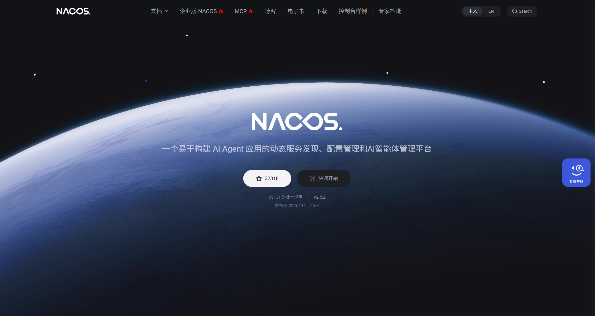

# Spring Cloud 微服务

---

## 1、单体架构与微服务架构

为什么会有微服务架构？

首先，对于中小型的项目，单体架构是完全够用的。但是，对于大型项目，单体架构往往会面临以下问题：

* 维护起来难度大
* 打包部署时间长
* 功能模块之间共享服务器资源，并发量受到限制

所以，有了微服务架构。微服务架构将各功能模块拆分成一个个独立的服务，各服务之间保持单一职责，独立开发维护，独立部署上线，解决了单体架构在大型项目中面临的难题。

## 2、微服务架构的拆分原则

一句话概括：高内聚，低耦合。

通常是根据业务功能进行拆分。

## 3、注册中心

### 3.1 什么是注册中心

注册中心是用来统一管理微服务，实现服务注册与服务发现的。

在微服务架构中，每个服务一般都是多实例部署的，而且它们之间往往有相互调用的关系。如何统一管理这些服务，以及一个服务在调用另一个服务时如何获取另一个服务的相关信息成了一个问题，即服务注册与服务发现的问题。

而注册中心就是用来解决这个问题的。所有服务在启动时可以向注册中心注册自己的相关信息，注册中心可以实时地监测各个服务的健康状态，并且当一个服务想调用另一个服务时，也可以从注册中心中获取相应服务的相关信息。

### 3.2 Nacos 注册中心

Nacos 是 Alibaba 开源的注册中心，而且它不光是一个注册中心，还是一个配置中心。总之，功能强大。



### 3.3 服务注册

要想将一个服务注册到 Nacos 注册中心中，首先要引入 Nacos 的相关依赖：

```xml
<dependency>
    <groupId>com.alibaba.cloud</groupId>
    <artifactId>spring-cloud-starter-alibaba-nacos-discovery</artifactId>
</dependency>
```

然后在 application.yml 配置文件中配置 Nacos 的地址：

```yml
spring:
  application:
    name: 服务名称
  cloud:
    nacos:
      server-addr: Nacos的IP地址和端口
```

这样，服务在启动后就会自动注册到 Nacos 中，并且我们可以在 Nacos 的控制台中查看到服务的相关信息。

### 3.4 服务发现

一个服务在调用另一个服务时，需要获取到另一个服务的相关信息，这个过程就叫做服务发现。

要想实现服务发现，也需要引入 Nacos 的相关依赖并配置 Nacos的地址（和服务注册一样）。

然后可以通过 Spring Boot 帮我们自动装配的 `DiscoveryClient` 来获取到相应服务的信息。比如通过 `DiscoveryClient` 的 `getInstaces()` 方法可以获取当相应服务的所有实例，然后我们可以通过负载均衡算法挑选一个实例去发起远程调用。


## 4、远程调用

### 4.1 什么是远程调用

微服务架构中，一个服务调用另一个服务的过程称为远程调用。

远程调用往往是微服务拆分后面临的第一个问题，我们当然可以通过手动构建 Http 请求的方式实现远程调用，但这太麻烦了。

我们可以通过远程调用框架来简化代码，使远程调用就像调用本地方法一样简单而丝滑。

### 4.2 OpenFeign

OpenFeign 是 Alibaba 开源的远程调用框架，通过它可以大大简化远程调用的代码。

使用 OpenFeign，首先需要引入 OpenFeign 相关依赖：

```xml
<dependency>
    <groupId>org.springframework.cloud</groupId>
    <artifactId>spring-cloud-starter-openfeign</artifactId>
</dependency>
```

通常我们还会引入一个负载均衡的依赖，用来在远程调用时实现负载均衡：

```xml
<dependency>
    <groupId>org.springframework.cloud</groupId>
    <artifactId>spring-cloud-starter-loadbalancer</artifactId>
</dependency>
```

此外，OpenFeign 底层依然是通过发送 Http 请求来实现远程调用的，并且可以灵活地切换不同的 Http 客户端。由于它默认使用的是  `HttpURLConnection`，不支持连接池，因此我们通常会使用带有连接池的 Http 客户端来代替默认的 `HttpURLConnection`。所以还可以引入一个带有连接池的 Http 客户端依赖：

```xml
<dependency>
  <groupId>io.github.openfeign</groupId>
  <artifactId>feign-okhttp</artifactId>
</dependency>
```

接下来，我们需要在 Spring Boot 的启动类或者配置类上添加 `EnableFeignClients` 注解用来开启 OpenFeign 远程调用功能。并且在 application.yml 配置文件中开启我们自己引入的 Http 客户端：

```yml
feign:
  okhttp:
    enabled: true
```

然后，我们可以针对要调用的服务编写一个 OpenFeign 客户端，其实就是一个接口，它大概是下面这样的形式：

```java
@FeignClient("item-service")
public interface ItemClient {
    @GetMapping("/items")
    List<ItemDTO> queryItemByIds(@RequestParam("ids") Collection<Long> ids);
}
```

这其实就是告诉 OpenFeign 我们想要调用的服务是什么，对应的接口和请求参数是什么。在使用时，OpenFeign 可以通过动态代理帮我们实现远程调用的相关逻辑，不用我们自己手动发起 Http 请求了。s

最后，我们只需要在当前服务的业务代码中注入刚才编写的 OpenFeign 客户端，然后调用其中定义的接口方法，就可以一行代码实现远程调用了。在这个过程中，OpenFeign 自动帮我们实现了服务发现、负载均衡、发送 Http 请求等工作。


